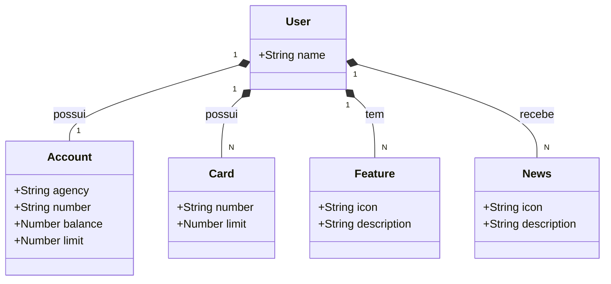

# Digital Banking API

API RESTful em Java criada no Bootcamp Bradesco - Java Cloud Native, com foco em cadastro e consulta de usuários e seus recursos financeiros.


## Objetivo

Este projeto demonstra a construção de uma API REST com Spring Boot, aplicando organização em camadas:

- `controller`: exposição dos endpoints HTTP
- `service`: regras de negócio
- `repository`: acesso aos dados
- `domain/model`: entidades do domínio

## Diagrama de Classes



## Tecnologias Utilizadas

- Java 17+
- Spring Boot
- Spring Web
- Spring Data JPA
- Gradle

Configurações de ambiente disponíveis em:

- `src/main/resources/application-dev.yml`
- `src/main/resources/application-prod.yml`

## Estrutura do Projeto

```text
src/main/java/me/dio
├── Application.java
├── controller
│   ├── UserController.java
│   └── exception/GlobalExceptionHandler.java
├── domain
│   ├── model
│   │   ├── User.java
│   │   ├── Account.java
│   │   ├── Card.java
│   │   ├── Feature.java
│   │   └── News.java
│   └── repository/UserRepository.java
└── service
    ├── UserService.java
    └── impl/UserServiceImpl.java
```

## Como Executar Localmente

### Pré-requisitos

- Java 17 (ou superior)

### Executando o projeto

```powershell
.\gradlew.bat bootRun
```

A aplicação será iniciada localmente na porta padrão `8080`.

## Endpoints Principais

Com base no `UserController`:

- `GET /users/{id}`: busca usuário por ID
- `POST /users`: cria um novo usuário

## Testes

Atualmente, o projeto possui um teste básico de contexto (`contextLoads` com `@SpringBootTest`), que valida se a aplicação inicia corretamente e se a configuração principal de beans está íntegra.

Esse teste é útil como verificação inicial (smoke test), mas **não cobre** regras de negócio, contratos dos endpoints ou cenários de erro.

Para executar os testes automatizados atuais:

```powershell
.\gradlew.bat test
```

## Deploy

O projeto possui `Procfile`, o que facilita o deploy em plataformas compatíveis com esse formato.

## Contribuição

1. Faça um fork do projeto
2. Crie uma branch para sua feature (`git checkout -b feature/minha-feature`)
3. Faça commit das suas alterações (`git commit -m "feat: minha nova feature"`)
4. Faça push para a branch (`git push origin feature/minha-feature`)
5. Abra um Pull Request

## Autor

Projeto desenvolvido para o Bootcamp Bradesco - Java Cloud Native, com exemplo do Santander Dev Week 2023 .
